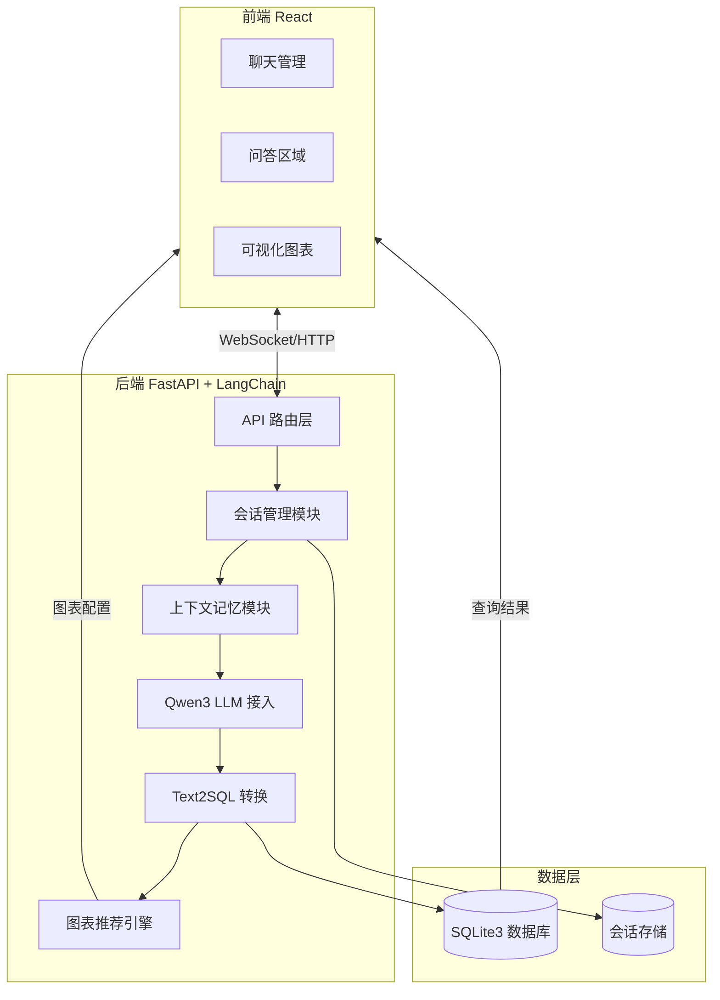
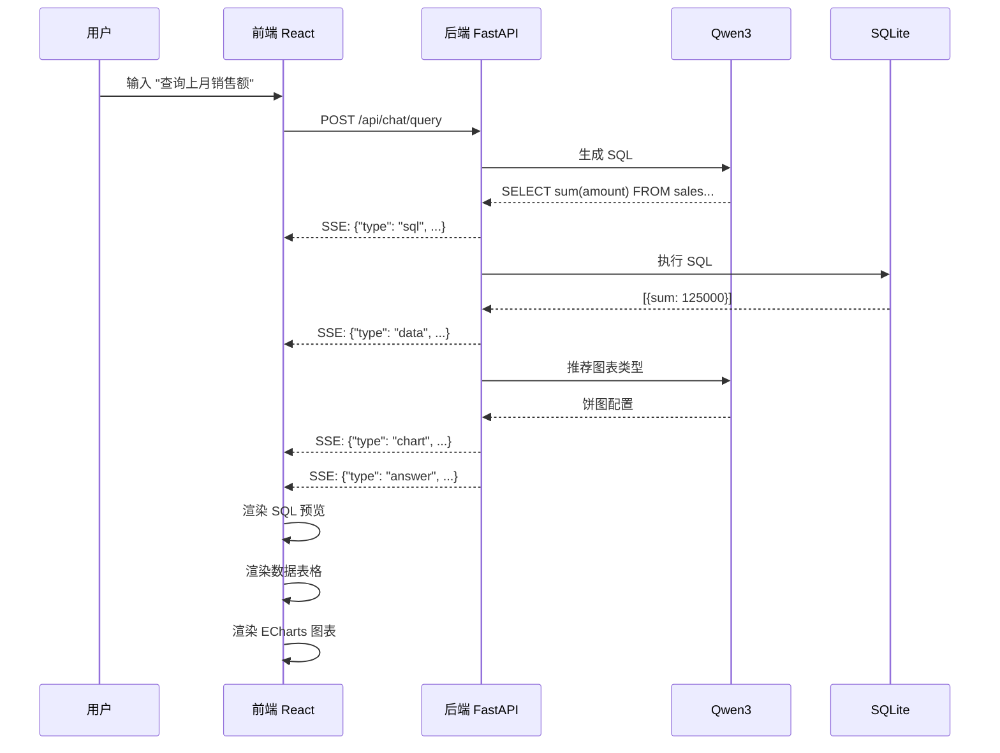

## 系统架构概览




---

## Phase 1: 前后端基础框架搭建 + 健康测试

### 目标

搭建可运行的前后端骨架，验证基础连通性。

### 后端任务

**项目结构：**

```
backend/
├── app/
│   ├── __init__.py
│   ├── main.py              # FastAPI 入口 + CORS 配置
│   └── config.py            # 环境变量配置
├── requirements.txt
├── .env.example
└── README.md
```

**核心文件：**

- `main.py`: FastAPI 应用、CORS 中间件、健康检查路由
- `config.py`: Pydantic Settings 管理环境变量
- `requirements.txt`: fastapi, uvicorn, python-dotenv, pydantic-settings

**健康检查接口：**

```
GET /health -> {"status": "ok", "version": "1.0.0"}
```

### 前端任务

**项目结构：**

```
frontend/
├── src/
│   ├── App.tsx
│   ├── main.tsx
│   └── vite-env.d.ts
├── package.json
├── tsconfig.json
└── vite.config.ts
```

**技术栈初始化：**

- Vite + React 18 + TypeScript
- Zustand 状态管理
- Axios 请求库
- Tailwind CSS 样式

**基础布局：** 创建三栏占位布局，验证项目可运行。

### 验收标准

- 后端 `python -m uvicorn app.main:app` 启动成功
- 访问 `GET /health` 返回 `{"status": "ok"}`
- 前端 `npm run dev` 启动成功
- 浏览器访问显示三栏布局

---

## Phase 2: 前端 UI 研发

### 目标

完成所有前端 UI 组件开发，使用 Mock 数据实现交互。

### 2.1 左侧边栏 - 会话管理

**组件：**

- `SessionList.tsx` - 会话列表
- `SessionItem.tsx` - 单个会话项
- `NewSessionBtn.tsx` - 新建会话按钮

**状态管理 (sessionStore.ts)：**

```typescript
interface SessionState {
  sessions: Session[];
  currentSessionId: string | null;
  createSession: () => void;
  deleteSession: (id: string) => void;
  selectSession: (id: string) => void;
}
```

### 2.2 中间区域 - 聊天交互

**组件：**

- `ChatContainer.tsx` - 聊天容器
- `MessageList.tsx` - 消息列表
- `MessageItem.tsx` - 消息气泡（用户/AI）
- `QueryInput.tsx` - 查询输入框
- `SqlPreview.tsx` - SQL 预览卡片

**状态管理 (chatStore.ts)：**

```typescript
interface ChatState {
  messages: Message[];
  isLoading: boolean;
  sendMessage: (content: string) => void;
  clearMessages: () => void;
}
```

### 2.3 右侧区域 - 可视化图表

**组件：**

- `ChartContainer.tsx` - 图表容器（空状态/展示状态）
- `BasicChart.tsx` - 基础图表（柱状图、折线图、饼图）
- `AdvancedChart.tsx` - 高级图表（散点图、雷达图）
- `DataTable.tsx` - 数据表格展示

**状态管理 (chartStore.ts)：**

```typescript
interface ChartState {
  chartConfig: EChartsOption | null;
  rawData: any[];
  updateChart: (config: EChartsOption, data: any[]) => void;
  clearChart: () => void;
}
```

### UI 布局效果

```
+------------------+------------------------+---------------------+
|     左侧边栏      |        中间区域         |      右侧区域       |
|   (会话管理)      |       (问答区域)        |    (可视化图表)     |
+------------------+------------------------+---------------------+
| [+ 新建会话]      |                        |                     |
|                  |  AI: 您好，有什么可以   |   ┌─────────────┐   |
| 会话列表:        |      帮您的？           |   │  图表区域    │   |
| ● 销售数据分析    |                         |   │  (ECharts)   │   |
| ○ 用户增长趋势    |  User: 查询上月销售额   │   │             │   |
| ○ 产品库存查询    |                         |   └─────────────┘   |
|                  |  AI: 已生成 SQL 查询    |                     |
|                  |                         |   数据表格预览:     |
|                  |  ┌───────────────────┐  |   ┌─────────────┐   |
|                  |  │ SQL:              │  |   │  表格数据    │   |
|                  |  │ SELECT sum(...)   │  |   └─────────────┘   |
|                  |  └───────────────────┘  |                     |
|                  |                         |                     |
|                  |  [输入查询...] [发送]    |                     |
+------------------+------------------------+---------------------+
```

### 验收标准

- 左侧会话列表可点击切换、新建、删除
- 中间消息列表支持滚动、输入框可发送
- 右侧图表区域可展示 Mock 图表
- 所有组件响应式适配

---

## Phase 3: 后端接口研发

### 目标

实现所有后端核心功能，提供完整 API。

### 3.1 LLM 接入模块

**文件：** `app/core/llm.py`

```python
class Qwen3LLM:
    def __init__(self, api_key: str)
    async def stream_chat(self, messages: list) -> AsyncGenerator
    async def generate_sql(self, question: str, schema: str) -> str
    async def recommend_chart(self, data: dict, question: str) -> dict
```

#### 3.1.1 Qwen3 API 字段规范

**API 配置：**


| 配置项      | 值                                                   |
| -------- | --------------------------------------------------- |
| Base URL | `https://dashscope.aliyuncs.com/compatible-mode/v1` |
| 端点       | `/chat/completions`                                 |
| 模型名称     | `qwen3-max`                                         |
| 认证方式     | `Authorization: Bearer {api_key}`                   |


**基础对话响应格式：**

```json
{
  "id": "chatcmpl-xxx",
  "object": "chat.completion",
  "model": "qwen3-max",
  "created": 1771843476,
  "choices": [{
    "index": 0,
    "finish_reason": "stop",
    "message": {
      "role": "assistant",
      "content": "响应内容"
    }
  }],
  "usage": {
    "prompt_tokens": 14,
    "completion_tokens": 37,
    "total_tokens": 51
  }
}
```

**流式输出 Chunk 格式：**

```json
{
  "id": "chatcmpl-xxx",
  "object": "chat.completion.chunk",
  "model": "qwen3-max",
  "choices": [{
    "index": 0,
    "delta": {
      "role": "assistant",
      "content": "增量内容"
    }
  }]
}
```

- 结束标识：`data: [DONE]`
- 第一个 chunk 包含 `role: "assistant"`

**函数调用响应格式：**

```json
{
  "choices": [{
    "index": 0,
    "finish_reason": "tool_calls",
    "message": {
      "role": "assistant",
      "content": "",
      "tool_calls": [{
        "id": "call_xxx",
        "type": "function",
        "index": 0,
        "function": {
          "name": "function_name",
          "arguments": "{\"param\": \"value\"}"
        }
      }]
    }
  }]
}
```

**关键字段说明：**


| 字段                                | 类型     | 说明                              |
| --------------------------------- | ------ | ------------------------------- |
| `finish_reason`                   | string | `stop`=普通结束, `tool_calls`=需调用工具 |
| `tool_calls[].id`                 | string | 调用ID，用于返回工具结果                   |
| `tool_calls[].function.name`      | string | 要调用的函数名                         |
| `tool_calls[].function.arguments` | string | JSON字符串格式的参数                    |
| `delta.content`                   | string | 流式输出的增量内容                       |


**错误处理：**


| HTTP 状态码 | 说明         |
| -------- | ---------- |
| 400      | 请求参数错误     |
| 401      | API Key 无效 |
| 429      | 请求频率超限     |
| 500      | 服务器内部错误    |


**实现注意事项：**

1. 使用 `httpx` 进行异步 HTTP 请求
2. 流式输出使用 `httpx.stream()` 处理 SSE
3. 函数调用时 `arguments` 是 JSON 字符串，需解析
4. 流式函数调用需累积拼接 `tool_calls` 参数

#### 3.1.2 NL2SQL 组件参数规范

**Tool 定义：**

```json
{
  "type": "function",
  "function": {
    "name": "execute_sql",
    "description": "执行 SQL 查询并返回结果",
    "parameters": {
      "type": "object",
      "properties": {
        "sql": {
          "type": "string",
          "description": "要执行的 SQL 查询语句"
        },
        "reason": {
          "type": "string",
          "description": "生成该 SQL 的原因（可选）"
        }
      },
      "required": ["sql"]
    }
  }
}
```

**Prompt 模板：**

```
System:
你是一个数据分析专家。根据用户问题，生成 SQL 查询来获取数据。

数据库结构:
{schema}

规则:
1. 使用 SQLite 语法
2. 调用 execute_sql 函数执行查询
3. SQL 必须符合数据库结构

User:
{user_question}
```

**Tool Call 响应格式：**

```json
{
  "choices": [{
    "finish_reason": "tool_calls",
    "message": {
      "role": "assistant",
      "content": "",
      "tool_calls": [{
        "id": "call_xxx",
        "type": "function",
        "function": {
          "name": "execute_sql",
          "arguments": "{\"sql\": \"SELECT ...\", \"reason\": \"...\"}"
        }
      }]
    }
  }]
}
```

**提取 SQL 流程：**

```python
# 1. 解析 tool_calls
tool_call = response["choices"][0]["message"]["tool_calls"][0]
arguments = json.loads(tool_call["function"]["arguments"])
sql = arguments["sql"]

# 2. 执行 SQL
cursor.execute(sql)
result = cursor.fetchall()

# 3. 返回工具结果
messages.append({
    "role": "tool",
    "tool_call_id": tool_call["id"],
    "content": json.dumps(result, ensure_ascii=False)
})
```

**多轮对话消息格式：**

```python
messages = [
    {"role": "system", "content": system_prompt},
    {"role": "user", "content": "查询总销售额"},
    # 第一轮 AI 响应（包含 tool_calls）
    {"role": "assistant", "content": "", "tool_calls": [...]},
    # 工具返回结果
    {"role": "tool", "tool_call_id": "call_xxx", "content": "[[60492.0]]"},
    # 第二轮用户问题
    {"role": "user", "content": "按地区分组统计"},
    # 第二轮 AI 响应
    ...
]
```

**SQL 提取正则（普通模式）：**

```python
import re
sql_match = re.search(r'

```sql\s*(.*?)\s*

```', content, re.DOTALL | re.IGNORECASE)
if sql_match:
    sql = sql_match.group(1)
```

**关键参数说明：**


| 参数                                       | 说明               |
| ---------------------------------------- | ---------------- |
| `tool_calls[].function.arguments.sql`    | 生成的 SQL 语句       |
| `tool_calls[].function.arguments.reason` | SQL 生成原因（可选）     |
| `tool_calls[].id`                        | 用于返回工具结果的 ID     |
| `messages[].role="tool"`                 | 工具消息的角色标识        |
| `messages[].tool_call_id`                | 对应的 tool_call ID |


---

### 3.2 数据库模块

**文件：**

- `app/db/sqlite_manager.py` - SQLite 连接与查询
- `app/db/schema_manager.py` - 动态表结构管理

```python
class SQLiteManager:
    async def execute_query(self, sql: str) -> list[dict]
    async def get_schema(self) -> str
    async def create_table(self, table_def: dict)
    async def insert_data(self, table: str, data: list)
```

### 3.3 LangChain Agent

**文件：** `app/core/langchain_agent.py`

```python
class DataAnalysisAgent:
    def __init__(self, llm: Qwen3LLM, db: SQLiteManager)

    async def process_query(self, question: str, session_id: str) -> dict:
        # 1. 获取上下文
        # 2. 生成 SQL
        # 3. 执行查询
        # 4. 推荐图表
        # 5. 返回结果
```

### 3.4 会话管理模块

**文件：**

- `app/db/session_store.py` - 会话持久化
- `app/memory/conversation.py` - 对话记忆

**API 接口：**

```
POST   /api/sessions              # 创建会话
GET    /api/sessions              # 获取会话列表
GET    /api/sessions/{id}         # 获取会话详情
DELETE /api/sessions/{id}         # 删除会话
GET    /api/sessions/{id}/history # 获取对话历史
```

### 3.5 聊天查询接口

**文件：** `app/api/chat.py`

```
POST /api/chat/query
Request:  { "session_id": "xxx", "question": "查询上月销售额" }
Response: SSE 流式响应
  data: {"type": "sql", "content": "SELECT ..."}
  data: {"type": "data", "content": [...]}
  data: {"type": "chart", "content": {...}}
  data: {"type": "answer", "content": "上月销售额为..."}
```

### 3.6 图表推荐引擎

**文件：** `app/core/chart_recommend.py`

```python
class ChartRecommender:
    def analyze_data(self, data: list[dict]) -> DataProfile
    def recommend_chart_type(self, profile: DataProfile, question: str) -> str
    def generate_echarts_config(self, data: list, chart_type: str) -> dict
```

### 后端完整项目结构

```
backend/
├── app/
│   ├── __init__.py
│   ├── main.py
│   ├── config.py
│   ├── api/
│   │   ├── __init__.py
│   │   ├── chat.py
│   │   ├── session.py
│   │   └── database.py
│   ├── core/
│   │   ├── __init__.py
│   │   ├── llm.py
│   │   ├── langchain_agent.py
│   │   ├── text2sql.py
│   │   └── chart_recommend.py
│   ├── db/
│   │   ├── __init__.py
│   │   ├── sqlite_manager.py
│   │   ├── schema_manager.py
│   │   └── session_store.py
│   ├── memory/
│   │   ├── __init__.py
│   │   ├── conversation.py
│   │   └── context.py
│   └── models/
│       ├── __init__.py
│       ├── request.py
│       └── response.py
├── data/
│   └── app.db
├── requirements.txt
└── .env
```

### 验收标准

- 所有 API 接口可通过 Postman/curl 测试
- LLM 流式响应正常工作
- SQLite 查询返回正确结果
- 会话持久化到数据库

---

## Phase 4: 前后端联调

### 目标

前后端对接，完成端到端功能。

### 4.1 API 服务层对接

**文件：** `frontend/src/services/api.ts`

```typescript
const API_BASE = import.meta.env.VITE_API_URL;

export const api = {
  // 会话管理
  getSessions: () => axios.get(`${API_BASE}/api/sessions`),
  createSession: () => axios.post(`${API_BASE}/api/sessions`),
  deleteSession: (id: string) => axios.delete(`${API_BASE}/api/sessions/${id}`),

  // 聊天查询（SSE 流式）
  sendQuery: (sessionId: string, question: string) => {
    return new EventSource(`${API_BASE}/api/chat/query?...`);
  }
};
```

### 4.2 流式响应处理

**Hook:** `frontend/src/hooks/useChat.ts`

```typescript
const useChat = () => {
  const handleQuery = async (question: string) => {
    const eventSource = api.sendQuery(sessionId, question);

    eventSource.onmessage = (event) => {
      const data = JSON.parse(event.data);
      switch (data.type) {
        case 'sql': setSqlPreview(data.content); break;
        case 'data': setTableData(data.content); break;
        case 'chart': setChartConfig(data.content); break;
        case 'answer': appendMessage(data.content); break;
      }
    };
  };
};
```

### 4.3 数据流验证




### 4.4 完整功能清单

- 创建新会话
- 切换会话并加载历史
- 删除会话
- 发送自然语言查询
- 实时显示 SQL 预览
- 实时显示数据表格
- 实时渲染可视化图表
- 对话上下文记忆
- 错误处理与提示

### 验收标准

- 完整业务流程可跑通
- 流式响应实时渲染
- 会话数据持久化
- 异常情况友好提示

---

## 技术选型确认


| 层级       | 技术           | 说明                  |
| -------- | ------------ | ------------------- |
| LLM      | 阿里云百炼 Qwen3  | 通过 DashScope API 接入 |
| Agent 框架 | LangChain    | SQL Agent + Tools   |
| 后端框架     | FastAPI      | 异步支持 + SSE          |
| 数据库      | SQLite3      | 应用数据库 + 会话存储        |
| 前端框架     | React 18     | 函数式组件 + Hooks       |
| 状态管理     | Zustand      | 轻量级状态管理             |
| 图表库      | ECharts      | 支持基础+高级图表           |
| UI 组件    | Tailwind CSS | 样式框架                |
| 构建工具     | Vite         | 快速开发体验              |


---

## 开发时间估算


| Phase   | 预估时间    | 说明       |
| ------- | ------- | -------- |
| Phase 1 | 0.5 天   | 基础框架搭建   |
| Phase 2 | 1.5 天   | 前端 UI 开发 |
| Phase 3 | 2 天     | 后端核心功能   |
| Phase 4 | 1 天     | 联调与测试    |
| **总计**  | **5 天** |          |


